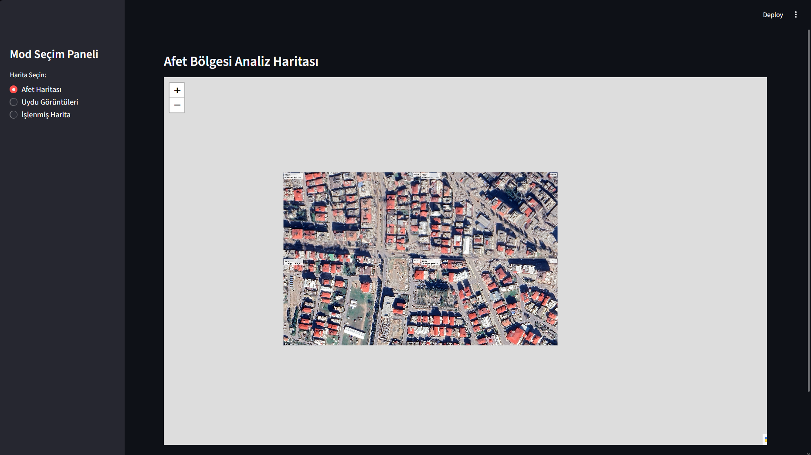

# GTLYazılım: Afet Bölgesi Analiz ve Haritalama Sistemi

Afet ekiplerinin deprem sonrasında İHA'lar ile elde edilen ham görüntüleri işleyerek, anlamlı ve coğrafi bir harita katmanına dönüştüren bir yazılım çözümüdür.

## Vizyonumuz
Afet sonrası hızlı ve doğru karar alma süreçlerini desteklemek adına;
- **Koordinasyon:** Ekiplerin planlı ilerlemesini sağlamak.
- **Hız:** Enkaz tespiti ve bölge analizini yapay zeka ile otomatikleştirmek.
- **Şeffaflık:** İşlenen verileri etkileşimli haritalar üzerinden sahadaki ekiplere sunmak.

## Proje Özellikleri
- **Enkaz Tespiti:** Kendi oluşturduğumuz 41 bin fotoğraflı özgün datasetimiz ile yolov8m modelini eğittik ortaya çıkan modeli enkaz tespitinde kullandık
- **Akıllı Haritalama:** Rasperry pi ile çektiğimiz fotoğrafların koordinat verilerine dayalı, birleştirilmiş mozaik harita katmanları.
- **Arayüz:** Streamlit tabanlı interaktif kontrol paneli ve geliştireceğimiz mobil intrnetsiz uygulamamız.
- **Veri Analitiği:** Tespit edilen enkazların anlık istatistiksel raporlanması, afet ekiplerine sunulması

---
*Projemizin detaylarını incelemek isterseniz aşağıdaki adımları inceleyebilirsiniz.*

## Projeyi Nasıl Çalıştırırım?
1. [Afet_Analiz_Sistemi.py dosyasını bulun](https://github.com/amanitav/GTLRescuerSoftware/blob/main/Afet_Analiz_Sistemi.py) bu linke girin ve Pycharm'ınıza kodları kopyalayın.
2. Gerekli kütüphaneleri yükleyin: `pip install ultralytics streamlit folium streamlit-folium opencv-python`
3. Terminale şu kodu yazın: `streamlit run sizin o anki dosya adınız.py`
Not (Önemli): kodunuzu çalıştırdığınızda sadece uydu görüntüleri kısmını çalıştırabileceksiniz diğer yerlerde hata verecek çünkü hem fotoğraflar sizde yok hem de koddaki yolo modelimiz sizde yok ve maalesefki modelimizi sizinle paylaşamayız ama bunu telafi olarak size diğer afet haritası ve işlenmiş harita sekmelerinin fotoğrafını githuba yükledik oradan bakabilirsiniz

### Proje Ekran Görüntüleri

**Afet Haritası:**

**İşlenmiş Harita (Enkaz Tespiti):**

